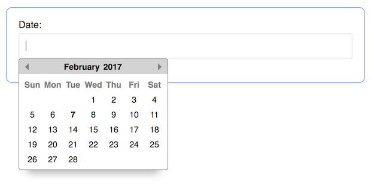

# Datepicker.js
Get a date with JavaScript! Datepicker has **no dependencies** and is _stupid lightweight_ weighing in at **2.6kb gzipped**! I mean, do you even bandwidth bro? Datepicker is simple to use and looks sexy on the screen. A calendar pops up and you pick a date. #Boom.



<!-- [Live Demo](http://aaroncordova.xyz/datepicker) -->

## Installation

#### Manually

Simply include `datepicker.css` in the `<head>`...
```html
<head>
  ...
  <link rel="stylesheet" href="datepicker.css">
  <!-- Via Unpkg CDN -->
  <!-- <link rel="stylesheet" href="https://unpkg.com/js-datepicker/datepicker.css"> -->
</head>
```

and include `datepicker.js` just above your closing `</body>` tag...
```html
<body>
  ...
  <script src="datepicker.js"></script>
  <!-- Via Unpkg CDN -->
  <!-- <script src="https://unpkg.com/js-datepicker"></script> -->
</body>
```

#### Via NPM
From the CLI run:
`npm install js-datepicker`

Files & locations:

|       File       |            Location             |             Description             |
| ---------------- | ------------------------------- | ----------------------------------- |
| datepicker.js    | node_modules/js-datepicker/     | our main file                       |
| dateicker.min.js | node_modules/js-datepicker/     | minified main file (2.6kb gzipped!) |
| datepicker.css   | node_modules/js-datepicker/     | stylesheet                          |
| datepicker.less  | node_modules/js-datepicker/less | less: use it for your own builds    |


## Usage

Datepicker takes 2 arguments:

1. A string representing a CSS selector, such as `'.my-class'`, `'#my-id'`, or `'div'`.
2. (optional) An object full of options (see below)

You can use Datepicker with any type of element you want. If used with an `<input>` element (the common use case), then the `<input>`'s value will automatically be set when selecting a date.

Simplest example:
```javascript
const picker = datepicker('.some-element');
```

## Options

| Option | Description |
| -------| ----------- |
| `position` | (string) Can be 1 of 4 values: `'tr'`, `'tl'`, `'br'`, `'bl'` representing top-right, top-left, bottom-right, and bottom-left respectively. Datepicker will position itself accordingly relative to the element you reference in the 1st argument. |
| `startDate` | (JS date object) This is the date that the calendar will start on. The default value is today. Example: `new Date()` |
| `dateSelected` | (JS date object) - This will start the calendar with a date already selected. If Datepicker is used with an `<input>` element, that field will be populated with this date as well. Example: `new Date(2017, 0, 15)` |
| `minDate` | (JS date object) - This will be the minumum threshold of selectable dates. Anything prior will be unselectable. Example: `new Date(2016, 5, 1)` |
| `maxDate` | (JS date object) - This will be the maximum threshold of selectable dates. Anything after it will be unselectable. Example: `new Date(2017, 11, 31)` |
| `noWeekends` | (boolean) - Provide `true` to disable selecting weekends. |
| `onSelect` | (function) - Callback function after a date has been selected. |
| `onShow` | (function) - Callback function when the calendar is shown. |
| `onHide` | (function) - Callback function when the calendar is hidden. |
| `onMonthchange` | (function) - Callback function when the month has changed. |

_NOTE: All callback functions are both bound to the Datepicker instance and passed the instance as its 1st argument. So you can simply access the instance via the_ `this` _keyword or the 1st argument._
